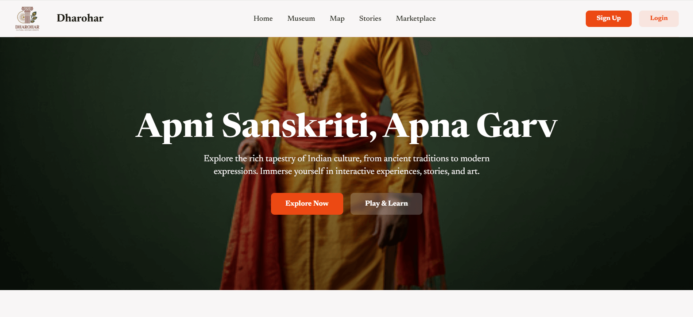
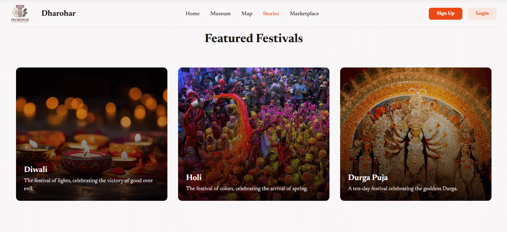
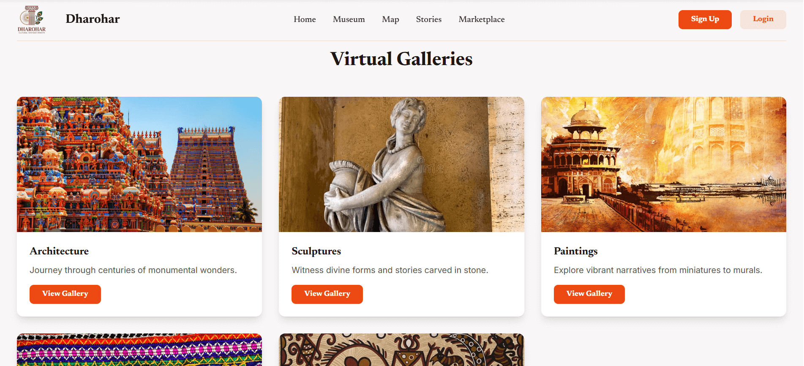
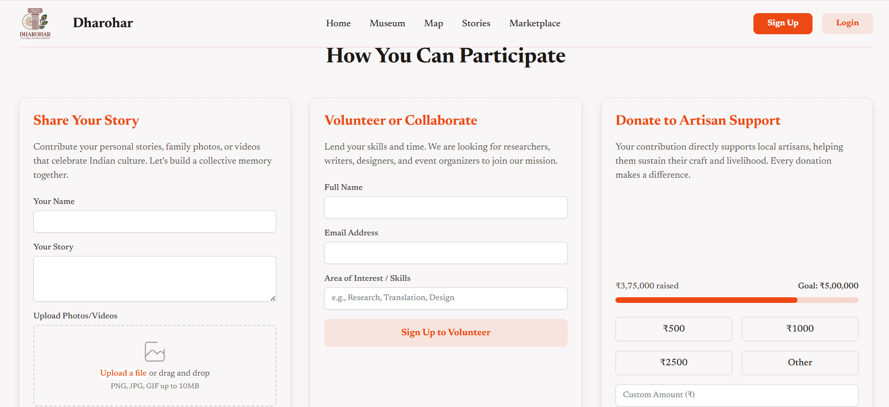
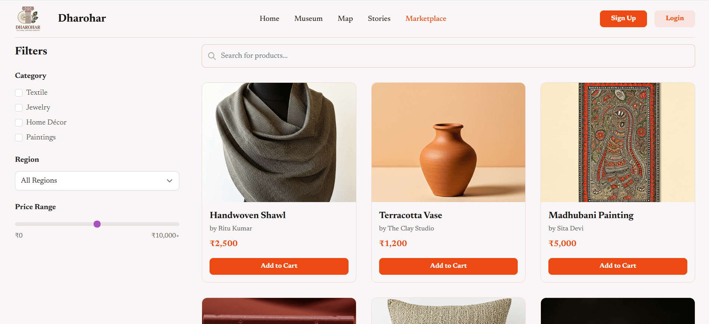
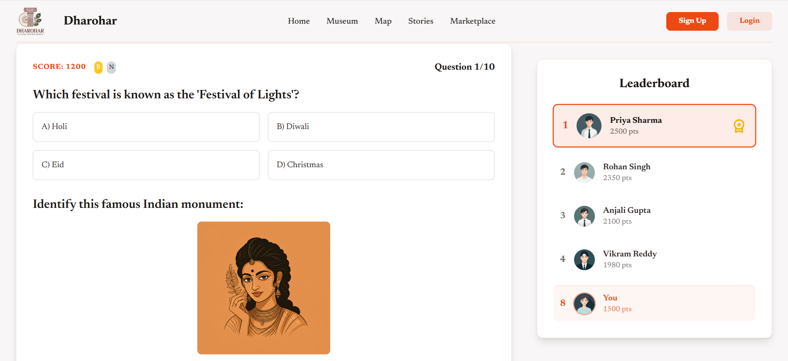
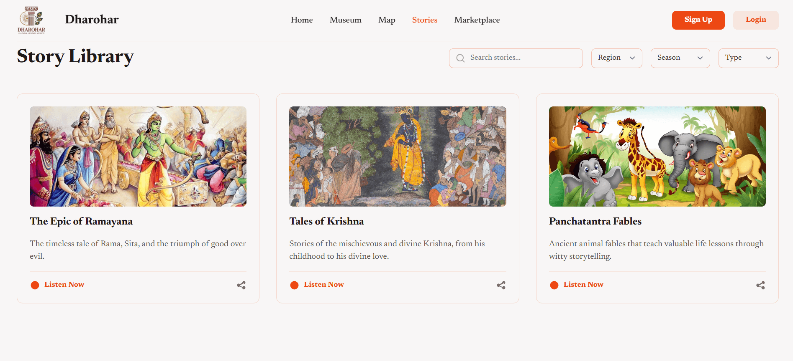

#  Smart India Hackathon 2025 – SIH Project

## ➤  Problem Statement
- **Student Innovation: Swadeshi for Atmanirbhar Bharat – Heritage & Culture**  
- **Problem Statement ID:** 25130  
- **Theme:** Heritage & Culture  
- **Category:** Software  

---

## ➤ Project Title  
### **Swadeshi Bharat – Digital Heritage Platform**

A technology-driven solution designed to **preserve, promote, and experience India’s rich cultural heritage** using modern digital tools.  
The platform focuses on supporting **Atmanirbhar Bharat** by empowering local artisans, traditions, and cultural tourism.

---

## ➤ Objectives
- Promote Indian heritage and culture through digital platforms  
- Support the **Atmanirbhar Bharat** initiative  
- Create awareness among youth and tourists  
- Help local artisans, craftsmen, and cultural communities  
- Digitally preserve traditional knowledge and heritage assets  

---

## ➤ Tech Stack
- **Frontend:** HTML, CSS, JavaScript / React  
- **APIs:** Maps API  
- **Hosting:** GitHub Pages

---

## ➤ Features
-  Cultural heritage location discovery  
-  Digital museum and virtual heritage tours  
-  Local art, traditions, and cultural showcase
-  Stories Section
-  Games & Quizes
-  Artisans Support
-  Promotion of Swadeshi and handmade products  
-  Fully responsive user interface

---

## ➤ Project Screenshots

<table>
  <tr>
    <td align="center">
      <b>Home</b> 
      
    </td>
    <td align="center">
      <b>Festivals</b> 
      
    </td>
  </tr>

  <tr>
    <td align="center">
      <b>Gallery</b> 
      
    </td>
    <td align="center">
      <b>Contribution</b> 
      
    </td>
  </tr>

  <tr>
    <td align="center">
      <b>Marketplace</b> 
      
    </td>
    <td align="center">
      <b>Quizzes</b> 
      
    </td>
  </tr>

  <tr>
    <td align="center">
      <b>Sign Up</b> 
      
    </td>
    <td align="center">
      <b>Stories</b> 
      
    </td>
  </tr>
</table>

---

## ➤ Team Details
**Team Name:** Decode-25#Team  

| Name | Role |
|-----|-----|
| Gagan Kumar | Team Lead & Frontend Developer |
| Monu Sharm | Backend Developer |
| Tushant | UI/UX Designer |
| Arjun Pal Singh | Database & API Manager |
| Saksham Mittal | Research & Documentation Lead |
| Priyanka Singh | Testing & Quality Assurance |

---

## ➤ Future Scope
- AI-based personalized heritage recommendations  
- AR/VR-powered virtual tours of monuments and temples  
- Integration with government tourism platforms  
- Mobile application development  
- Expansion to international heritage collaborations  

---

## ➤ Live Demo
https://codeby-gagan.github.io/SIH-2025-Swadeshi-Heritage-Culture/

---

## ➤ License
This project is developed exclusively for **Smart India Hackathon 2025**.  
© 2025 **Decode-25#Team**

This project is not intended for commercial use without prior permission.

